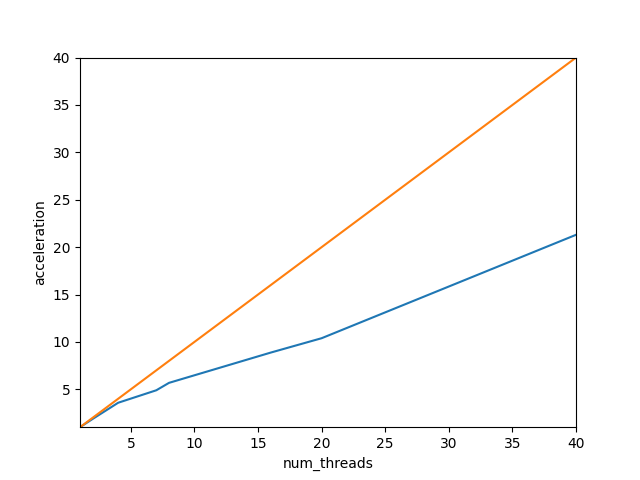
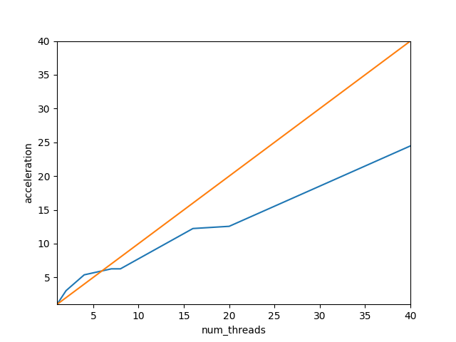

## TASK 1. DGEMV

| dgemv        	| num_threads 	|      	|      	|      	|      	|       	|       	|       	|
|--------------	|-------------	|------	|------	|------	|------	|-------	|-------	|-------	|
| N            	| 1           	| 2    	| 4    	| 7    	| 8    	| 16    	| 20    	| 40    	|
| 20000        	| 4,26        	| 2,27 	| 1,19 	| 0,87 	| 0,75 	| 0,48  	| 0,41  	| 0,2   	|
| acceleration 	| 1           	| 1,87 	| 3,57 	| 4,89 	| 5,68 	| 8,87  	| 10,39 	| 21,3  	|

| dgemv        	| num_threads 	|      	|      	|      	|      	|       	|       	|       	|
|--------------	|-------------	|------	|------	|------	|------	|-------	|-------	|-------	|
| N            	| 1           	| 2    	| 4    	| 7    	| 8    	| 16    	| 20    	| 40    	|
| 40000        	| 23,49       	| 7,74 	| 4,37 	| 3,75 	| 3,75 	| 1,92  	| 1,87  	| 0,96  	|
| acceleration 	| 1           	| 3,03 	| 5,37 	| 6,26 	| 6,26 	| 12,23 	| 12,56 	| 24,46 	|

