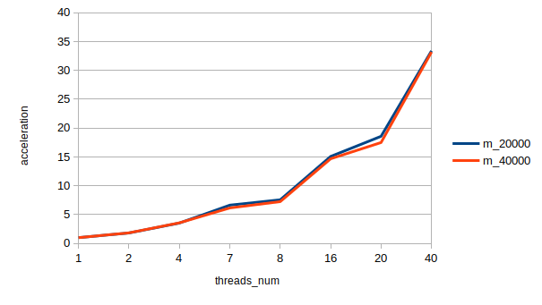
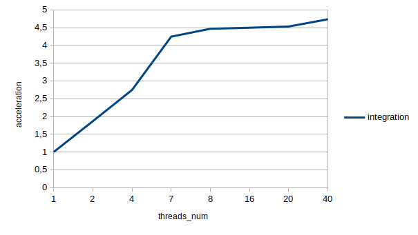
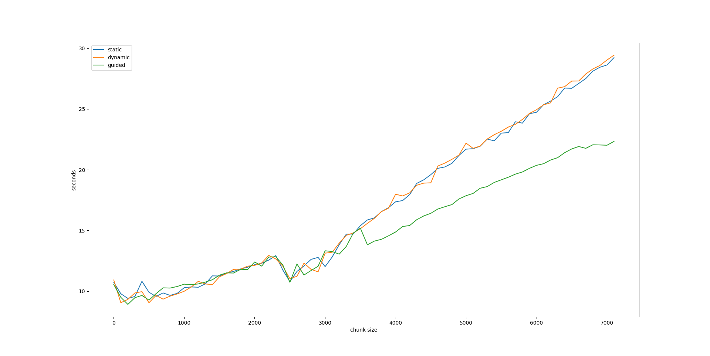

## TASK 1. DGEMV
|         |threads_num|          |          |          |          |           |           |           |
|---------|-----------|----------|----------|----------|----------|-----------|-----------|-----------|
| M=N     | 1         | 2        | 4        | 7        | 8        | 16        | 20        | 40        |
| 20000   | 1.897642  | 1.047206 | 0.538065 | 0.286231 | 0.250989 |  0.125837 |  0.102153 |  0.056830 |
|ускорение|	1	      | 1,812100 | 3,526789 | 6,629757 | 7,560658 | 15,080159 | 18,576468 | 33,391553 |
| 40000   | 7.563240  | 4.138768 | 2.121325 | 1.229091 | 1.044516 |  0.515359 |  0.432267 |  0.227850 |
|ускорение|	1         | 1,827413 | 3,565337	| 6,153523 | 7,240903 |	14,675672 |	17,496686 |	33,193943 |

## TASK 2. Integration

| integrate |threads_num|                  |                  |                  |                  |                  |                  |                  |
|-----------|-----------|------------------|------------------|------------------|------------------|------------------|------------------|------------------|
| 40000000  | 0,742487  | 0,397564         | 0,270315         | 0,174825         | 0,166148         | 0,165088         | 0,163835         | 0,156777         |
| ускорение | 1         | 1,867591         | 2,746747         | 4,247029         | 4,468828         | 4,497522         | 4,531919         | 4,735943         |

## TASK 3. SLE

